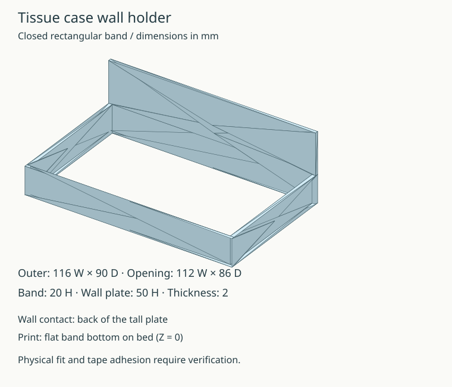

# ティッシュケース用 壁付けロの字ホルダー

写真の上側ホルダーを置き換えるJSCADモデルです。左右の腕を前面の横桟でつないで閉じた枠にしています。下側の受け皿は既存品を使います。



| 部分 | 寸法 |
| --- | --- |
| 外寸幅 | 116 mm |
| 外寸奥行き（背板を含む） | 90 mm |
| 腕と前面の枠の高さ | 20 mm |
| 両面テープを貼る背板 | 幅116 × 高さ50 mm |
| 板厚 | 2 mm |
| ケースが通る開口 | 幅112 × 奥行き86 mm |

幅と奥行きはユーザー確認済みの外寸です。腕の厚み2 mmはユーザーの実測値です。前面と背板も2 mmとしています。ケースの実測寸法は幅110 mm、奥行き約84 mmなので、開口との差は幅・奥行きとも合計2 mm（中央配置で片側約1 mm）です。造形誤差とケースの形状による嵌合は実物で確認してください。

## ファイル

- `holder.js`: JSCADソース。ブラウザ版JSCADで開くと寸法を変更できます。
- `output/tissue-holder.stl`: 初期寸法の印刷用STL。
- `output/preview.svg`: モデルから生成したプレビュー。

## 再生成

このディレクトリで実行します。

```sh
mise exec -- npm ci
mise exec -- npm run build
```

STLの初期寸法を変更する場合は`holder.js`の`defaults`を変更し、`build.js`の寸法・体積・開口の検証値も変更後の設計に合わせて更新してください。

## 印刷と取り付け

STLはロの字の下端がZ=0にあり、そのまま印刷台へ置く向きです。背板はZ=50まで立ち上がります。底板はなく、ケースは上から枠を通し、既存の下側受け皿へ載せます。ケースを上から差し込める取り付け位置にしてください。

壁に接する背板の平面へ両面テープを貼ります。実物の嵌合、印刷後の強度、長期変形、両面テープの保持力は未検証です。

API参照: [JSCAD公式ドキュメント](https://openjscad.xyz/docs/)
